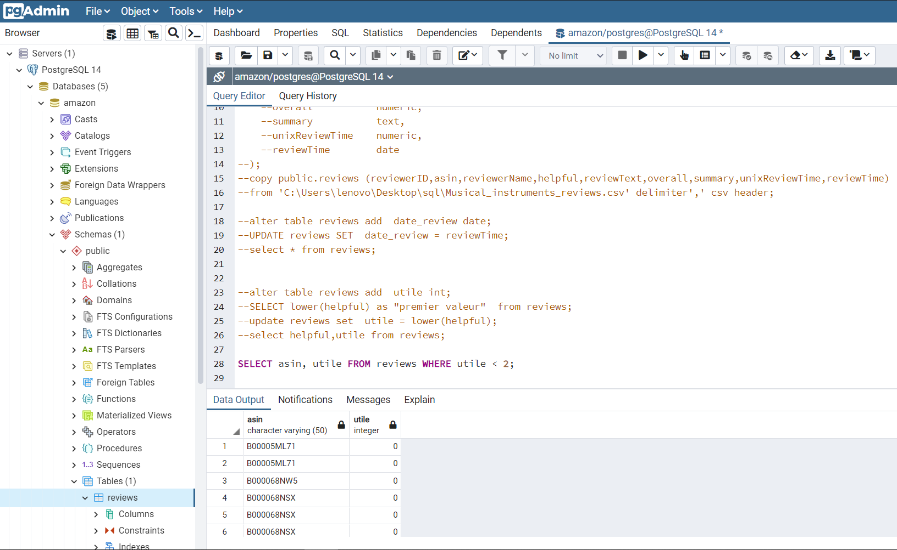
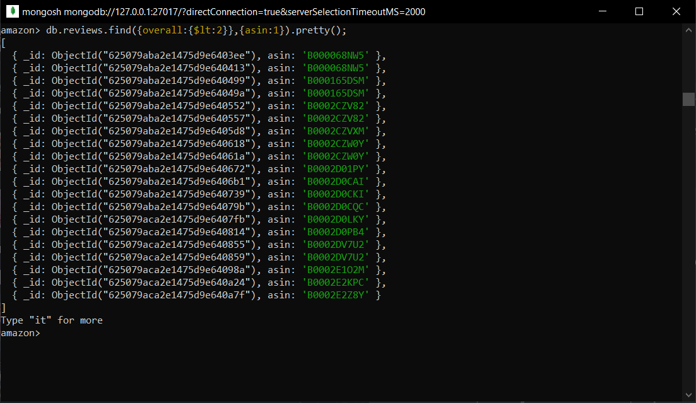

Your Company  
Amazon-reviews data-set

MS Data Engineering

Abdelhadi CHAJIA

**PARTIE SQL POSTGRESQL**

**Recapitulatif des codes SQL sous PostgreSql**

**1.  create database amazon;**

**2.  Create table if not exists reviews**

**(**

**identity_c   bigint GENERATED ALWAYS AS IDENTITY PRIMARY KEY,**

**reviewerID   varchar(50) not null,**

**asin    varchar(50) not null,**

**reviewerName  varchar(50),**

**helpful    numrange,**

**reviewText  text,**

**overall   numeric,**

**summary  text,**

**unixReviewTime interval,**

**reviewTime  date**

**);**

**3.  copy public.reviews (reviewerID,asin,reviewerName,helpful,reviewText,overall,summary,unixReviewTime,reviewTime)from 'C:\\Users\\lenovo\\Desktop\\sql\\Musical_instruments_reviews.csv' delimiter',' csv header;**

**4. alter table reviews add date_review date;**

**4.1  UPDATE reviews SET date_review = reviewTime;**

**select \* from reviews;**

**5.  alter table reviews add utile int;**

**5.1  SELECT lower(helpful) as "premier valeur" from reviews;**

**5.2 update reviews set utile = lower(helpful);**

**select helpful,utile from reviews;**

**6.1  SELECT asin, utile FROM reviews WHERE utile \< 2;**

**6.2  SELECT utile,reviewText FROM reviews WHERE utile \> 20;**

**6.3  SELECT asin, round(avg(utile),2) as moyenne_note, count(reviewText) as nbr_commentaire from reviews group by asin;**

**6.4  SELECT asin,count(reviewText) as nbr_reviewtext from reviews group by asin order by nbr_reviewtext desc limit 1;**

**6.5  SELECT reviewtime,reviewerName from reviews where date_review between '2013-06-01' AND '2013-06-30';**

**6.7  SELECT identity_c,reviewText FROM reviews WHERE reviewText iLIKE '%very good%';**

**6.8  SELECT reviewtime,reviewername, count(\*) as nbr_sup_à_2 FROM reviews group by reviewtime,reviewername having count(\*) \> 2;**

|   | **Créer une nouvelle base de données amazon** |
|---|-----------------------------------------------|

Pour crée une base donnée sous PostgreSQL J’ai utilisé la commande suivante :

**Create database amazon ;**

****

|   | **Créer une table reviews compatible avec le fichier de données CSV. Définir une clé artificielle. Garder le même nom des colonnes que dans le Header du fichier CSV.** |
|---|-------------------------------------------------------------------------------------------------------------------------------------------------------------------------|

Pour crée la table j’ai utilisé la commande create table puis j’ai indiqué pour chaque colonne le type selon la donnée stockée ainsi j’ai utilisé comme key artificiel la colonne identity_c son type c’est bigint avec « GENERATED ALWAYS AS IDENTITY PRIMARY KEY » qui génere des clés avec une séquence

**Create table if not exists reviews**

**(**

**identity_c   bigint GENERATED ALWAYS AS IDENTITY PRIMARY KEY,**

**reviewerID   varchar(50) not null,**

**asin    varchar(50) not null,**

**reviewerName   varchar(50),**

**helpful    numrange,**

**reviewText  text,**

**overall   numeric,**

**summary  text,**

**unixReviewTime interval,**

**reviewTime  date**

**);**

****

|   | **Importer les données à partir du fichier CSV au niveau de la table reviews** |
|---|--------------------------------------------------------------------------------|

J’ai importé les données via la commande suivant :

**copy public.reviews (reviewerID,asin,reviewerName,helpful,reviewText,overall,summary,unixReviewTime,reviewTime)**

**from 'C:\\Users\\lenovo\\Desktop\\sql\\Musical_instruments_reviews.csv' delimiter',' csv header;**

****

|   | **Ajouter une nouvelle colonne date_review de type date à la table reviews. Mettre à jour cette colonne à partir de la colonne unixReviewTime ou de la colonne reviewTime** |
|---|-----------------------------------------------------------------------------------------------------------------------------------------------------------------------------|

J’ai utilisé préalablement la commande alter table pour ajouter la colonne « date_review » à la table avec son type, puis la commande update pour que la colonne date_review sois identique à celle du reviewTime

**alter table reviews add date_review date;**

**UPDATE reviews SET date_review = reviewTime;**

****

|   | **La colonne helpful représente deux valeurs, la première valeur correspond au nombre d’utilisateurs ayant considéré le commentaire comme Helpful. Exemple : [13, 14] indique que 13 utilisateurs ont considérés que ce commentaire est utile. Ajouter une nouvelle colonne utile de type entier à la table reviews. Mettre à jour cette colonne à partir de la colonne helpful (première valeur)** |   |
|---|-----------------------------------------------------------------------------------------------------------------------------------------------------------------------------------------------------------------------------------------------------------------------------------------------------------------------------------------------------------------------------------------------------|---|

J’ai utilisé préalablement la commande alter table pour ajouter la colonne « utile» à la table avec son type int avec le syntaxe suivant :

**alter table reviews add utile int;**

Par la suite j’ai sélectionné les premières valeurs avec la syntaxe suivant

**select lower(helpful) as "premier valeur" from reviews;**

Puis j’ai stocker les premières valeurs dans la colonne utile avec la syntaxe suivant

**update reviews set utile = lower(helpful);**

****

## 

|   | **Donner pour chaque question la requête SQL correspondant (avec capture d’écran des résultats) :** |
|---|-----------------------------------------------------------------------------------------------------|

1.  Quels sont les produits qui ont eu une note inférieure à 2 (colonne overall) ?

    Avec la commande select et le where clause on peu générer le resultat voulu

**SELECT asin, utile FROM reviews WHERE utile \< 2**

1.  Quels sont les commentaires qui ont été considérés comme utile par plus que 20 utilisateurs ?

    On doit sélectionner tout d’abord la colonne reviewText puis appliquer le where clause

**SELECT reviewText,utile FROM reviews WHERE utile \> 20;**

1.  Donner pour chaque produit, le nombre de commentaires et la moyenne de la note ?

    Aggregation par produit la moyenne et le count des commentaire

**SELECT asin,avg(utile), count(reviewText) FROM reviews group by asin;**

1.  Quel est le produit qui a eu le plus de commentaires ?

    J’ai selectionné « asin » avec le « count des commentaire » puis j’ai ordonné décroissant les nombres des commentaires

**SELECT asin,count(reviewText) as nbr_reviewtext from reviews group by asin order by nbr_reviewtext desc limit 1;**

1.  Quels sont les utilisateurs qui ont posté un commentaire en Juin 2013 ?

    J’ai selectionner les reviewer et le reviewTime puis j’ai applique le between clause pour selectionner la tranche de date souhaité

**SELECT reviewtime,reviewerName from reviews where date_review between '2013-06-01' AND '2013-06-30';**

1.  Quels sont les produits qui ont reçu un commentaire contenant la phrase « very good » (traiter le cas de la majuscule/minuscule) ?

    L'opérateur ILIKE est utilisé de la même manière que l'opérateur LIKE. La différence est que ILIKE me permer d'effectuer une correspondance de modèle insensible à la casse

**SELECT identity_c,reviewText FROM reviews WHERE reviewText iLIKE '%very good%';**

1.  Quels sont les utilisateurs qui ont commentés plus que deux produits le même jour ?

    Sélectionner les colonnes concernées puis le count de tout puis grouper par les colonnes en question en ajoutant la condition

**SELECT reviewtime,reviewername, count(\*) FROM reviews group by reviewtime,reviewername having count(\*) \> 2;**

**PARTIE NOSQL MONGODB**

| **Récapitulatif des codes NoSql sur mongodb** |   |
|-----------------------------------------------|---|

**4 db.reviews.updateMany({},[{"\$set": {"date_review": { \$toDate:{ "\$multiply": ["\$unixReviewTime",1000]}}}}]);**

**5.1 db.reviews.find({overall: {\$lt:2}}, {asin:1}).pretty();**

**5.2 db.reviews.find({"helpful.0":{\$gt:20}}, {reviewText:1}).pretty();**

**5.3 db.reviews.aggregate({\$group :{_id : "\$asin",reviewText : {\$sum: 1},overall : { \$avg: "\$overall"}}});**

**5.4 db.reviews.aggregate({\$group :{_id : "\$asin",reviewText : {\$count: {}}}}, {\$sort:{reviewText:-1}},{\$limit: 5});**

**5.5 db.reviews.find({date_review:{\$gt:ISODate("2013-06-01"),\$lt:ISODate("2013-06-30")}})**

**5.6 db.reviews.aggregate([{\$match: {\$expr: { \$gt: [{\$indexOfCP: [{\$toLower:"\$reviewText"}, "very good"]}, -1]}}}, {\$project: {reviewText:1}}]);**

**5.7db.reviews.aggregate([{\$group:{_id:{reviewerName:"\$reviewerName",reviewTime:"\$reviewTime"},count:{\$sum:1}}},{\$match:{count:{\$gt:2}}}])**

|   | Créer une nouvelle base de données amazon |
|---|-------------------------------------------|

|   | Créer une nouvelle collection reviews. |
|---|----------------------------------------|

1.  Créer une nouvelle collection reviews.
2.  Créer une nouvelle base de données amazon

    J’ai créé la base et la collection à l’aide du bouton « **Create database** »

    

    

|   | Importer les documents à partir du fichier JSON au niveau de la collection reviews |
|---|------------------------------------------------------------------------------------|

J’ai importé les données à l’aide du bouton ADD DATA

|   | Ajouter un nouveau champ date_review de type date à tous les documents de la collection reviews. Mettre à jour ce nouveau champ pour chaque document à partir du champ unixReviewTime ou du champ reviewTime |
|---|--------------------------------------------------------------------------------------------------------------------------------------------------------------------------------------------------------------|

db.reviews.updateMany(

{},

[

{"\$set": {"date_review": { \$toDate:{ "\$multiply": ["\$unixReviewTime",1000]}}}}

]

)

TimeStamp UNIX est le nombre de secondes écoulées depuis le 1er janvier 1970. Puisqu’on un nombre en secondes, on doit le multiplier par 1000. Puis je l’ai converti avec « toDate » clause en ajoutant une autre colonne avec « set » qui va être la place des données convertis

| Donner pour chaque question la requête MongoDB correspondant (avec capture d’écran des résultats) : |
|-----------------------------------------------------------------------------------------------------|

1.  Quels sont les produits qui ont eu une note inférieure à 2 (colonne overall) ?

    La commande find avec la condition “less than”

**db.reviews.find({overall: {\$lt:2}}, {asin:1}).pretty();**

1.  Quels sont les commentaires qui ont été considérés comme utile par plus que 20 utilisateurs ?

Interroger un array par longueur avec « .0 » ou « .1 » selon le born souhaité avec la gondition greater than

**db.reviews.find({"helpful.0":{\$gt:20}}, {reviewText:1}).pretty();**

1.  Donner pour chaque produit, le nombre de commentaires et la moyenne de la note ?

Groupement par la moyenne et le count des colonnes en question

**db.reviews.aggregate({\$group :{_id : "\$asin",reviewText : {\$sum: 1},overall : { \$avg: "\$overall"}}});**

1.  Quel est le produit qui a eu le plus de commentaires ?

    J’ai selectionné « asin » avec le « count des commentaire » puis avec le nombre décroissant on peut avoit le max des commntaires

**db.reviews.aggregate({\$group :{_id : "\$asin",reviewText : {\$count: {}}}}, {\$sort:{reviewText:-1}},{\$limit: 1});**

1.  Quels sont les utilisateurs qui ont posté un commentaire en Juin 2013 ?

J’ai selectionner la date_review puis j’ai applique la diffirence entre greater than and less than

**db.reviews.find({date_review:{\$gt:ISODate("2013-06-01"),\$lt:ISODate("2013-06-30")}})**

1.  Quels sont les produits qui ont reçu un commentaire contenant la phrase « very good » (traiter le cas de la majuscule/minuscule) ?

« Tolower » permet de rendre toutes les lettres en minuscule et aggregation par indexofcp qui permet de Recherchee dans une chaîne une occurrence d'une sous-chaîne et renvoie l'index de point de code UTF-8 (basé sur zéro) de la première occurrence. Si la sous-chaîne n'est pas trouvée, renvoie -1.

**db.reviews.aggregate([{\$match: {\$expr: { \$gt: [{\$indexOfCP: [{\$toLower:"\$reviewText"}, "very good"]}, -1]}}}, {\$project: {reviewText:1}}]);**

1.  Quels sont les utilisateurs qui ont commentés plus que deux produits le même jour ?

grouper par les colonnes en question en ajoutant la condition « match » dont le fonctionnement est similaire à « where » avec la condition greater than

**db.reviews.aggregate([{\$group:{_id:{reviewerName:"\$reviewerName",reviewTime:"\$reviewTime"},count:{\$sum:1}}},{\$match:{count:{\$gt:2}}}])**

